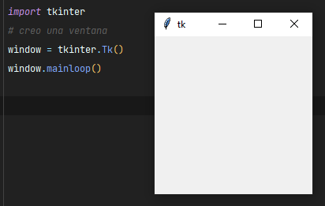
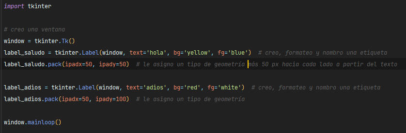
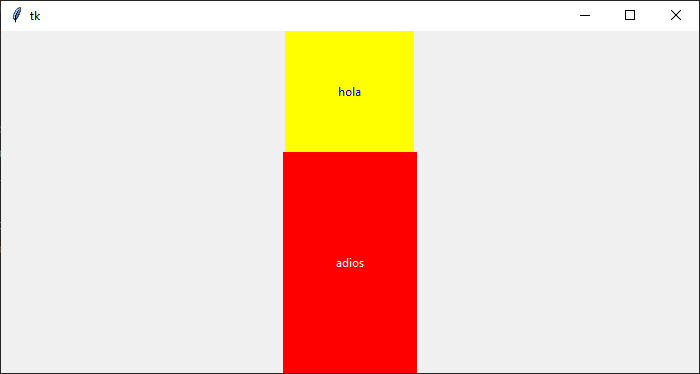
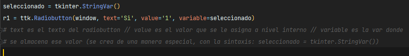

# Clase 10 GUI (Graphical User Interface)
[//]: <> (Básicamente, es la interfaz gráfica que usamos, al igual que visual studio, eclipse etc... y también las 
interfaces que creamos para interactuar con la lógica que escribimos
En el video las configuraciones básicas 
¡¡¡¡está instalado por defecto el tkinter perdí 2 horas en CMD!!!!)
[//]: <> (This is also a comment.)
Es una aplicación que nos muestra de manera grafica una interfaz para interactuar con un programa nativo y también 
con otros por debajo, reaccionan a **"eventos"** paradigma orientado a eventos.
Los eventos necesitan un *callback* que es una **función** que recibe un parámetro.
## Ejemplos de GUI
* PyGTK 
* PyQT
* WxPython
* Tkinter (utiliza otro lenguaje '**Tcl/Tk**' y es la más utilizada en python)

Ver https://pythonrepo.com/repo/ParthJadhav-Tkinter-Designer-python-graphical-user-interface-applications
Tcl es un lenguaje y Tk es un tool kit para crear interfaces en dicho lenguaje. 
## Tkinter
Para poder utilizarlo necesitamos componentes o widget 'son los controles, botones inputs etiquetas etc.' todo eso va 
en contenedores 2 tipos básicos son **frames y ventanas**.

En el ejemplo creo una ventana y luego creo un loop para que no se cierre hasta que lo haga yo.

### Hay 3 tipos de geometría para utilizar y posicionar los objetos dentro de las ventanas, 
* pack 
* grid 
* place
#### Súper ejemplo: https://python-para-impacientes.blogspot.com/2015/12/tkinter-disenando-ventanas-graficas.html#:~:text=En%20Tkinter%20existen%20tres%20gestores,cualquiera%20de%20estos%20gestores%2C%20indistintamente.

resultado 

`label_adios.pack(ipadx=50, ipady=100, fill='both')  # con fill rellena según el tamaño de la ventana` 

Hay muchas modificaciones más parecidas a CSS que no amerita integrar al resumen, ya que no lo voy a trabajar por 
consola ni código sino en figma 

## Radio button

## Ejemplo de evento

Ver final de la clase otra vez