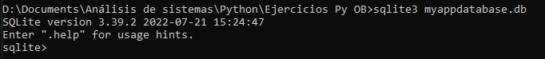

# Bases de datos
<https://docs.hektorprofe.net/python/bases-de-datos-sqlite/consultas-sql-basicas/> explicado sencillo.

He instalado sqlite3 a través de CMD, pero tuve que volver sobre mis pasos para que funcione en Windows.
Con este video <https://www.youtube.com/watch?v=X2r4Sky01lw>

También instale el plugin de DB en PyCharm gracias a:
<https://www.foxinfotech.in/2018/08/how-to-view-database-tool-window-in-pycharm.html>

Con el comando **`d:`** y luego **`cd`** para abrir la ruta que luego copie y pegue
**`D:\Documents\Análisis de sistemas\Python\Ejercicios Py OB`**

**minuto 9:30 creación de DB, tabla e inserción de datos. minuto 14 aproximadamente uso en pycharm.**

lo volví a instalar con esta sintaxis

<https://www.codegrepper.com/code-examples/python/how+to+install+sqlite3+in+python>

<https://www.ionos.mx/digitalguide/servidores/know-how/comandos-cmd/>

### No lograba que funcione y lo solucione con este video

> <https://www.youtube.com/watch?v=X2r4Sky01lw>

Ahora sí quedó instalado y listo para usar.

## Documentación de SQlite3

> <https://www.sqlite.org/cli.html>

### Con la siguiente sintaxis creé una base de datos, y creé también una tabla básica

*Importante, si solamente creo la base no va a mostrar nada, necesita tener algo de contenido*
***`"sqlite3 + nombre de data base.db"`***

### Creo la tabla

Al presionar *enter* no paso nada es porque no hubo ningún error. A continuación consulto las tablas para verificar
que exista.

 Claramente existe.

### Inserto 2 usuarios

Si hubiera usado por ejemplo la misma primary key me hubiera dado un error, minuto 11:43

### Verifico los datos

 Si no coloco el **`';'`** sqlite3 seguirá esperando a que termine la consulta.
También puedo usar `.help` para ver los comandos o ver la documentación oficial con el link del principio.

> The message that you are “Connected to a transient in-memory database” is normal when you start SQLite without
> opening an actual database file. It is telling you that you are connected to a database that will not persist forever
> – it is not saved to disk. This message goes away once you open an actual database file.

**Pensando que ya estaba solucionado surgió otro error, PyCharm no reconoce la base de datos en sqlite3 aunque estén
los drivers supuestamente instalados. No encuentro la manera de hacer correctamente la connection y me da un error de
filtros que al ignorarlo me deja seguir (los cambios que hago desde cmd y de pycharm al guardarlos quedan los dos.
En principio es muy raro, pero de esa manera funciona) a la base la abro con doble clic desde la carpeta de windows y
abre automático en cmd, y desde pycharm voy a Schemas en el navegador de bd despliego y ahi veo la tabla y datos.**

### Continuo con la lección a pesar de los errores en PyCharm. Edite el error eligiendo en ID = not null y opera mejor

Hice el pip install pysqlite3 en la carpeta de este proyecto para probar. Continuando con la clase desde Python conecté
la DB de la siguiente manera:

``import sqlite3``

``conn = sqlite3.connect('clase11.sqlite')``
**conn** es solo una variable que se usa por convención para poder trabajar.

La conexión se cierra con `conn.close()` y ***todo mi código van en medio***, para trabajar en DB con python se usan cursores
que van iterando las órdenes, estos se asignan y cierran también. `cursor = conn.cursor()`
`cursor.close()`.

Los rows o queries se ejecutan con `cursor.execute` estos a su vez se guardan en la variable "por convención" ROWS
con la siguiente sintaxis como ejemplo: `rows = cursor.execute('SELECT * FROM prueba')`

  

Para filtrar un solo row, sigo profundizando en los filtros de sql por ejemplo la cláusula`WHERE`.

   *La columna fue escrita entre comillas dobles*

## Sistema de verificación de usuario y contraseña

* ¡Creo la función main para trabajar, (no lo entiendo bien!!)

* Luego creo una función para preguntar datos y verificarlos con `getpass`, operando las consultas a la base de datos 
como en el ejemplo anterior.

* otra vez un problema  pero la consulta está bien hecha.
* VER A PARTIR DE MIN 25 Y VER OTRA VEZ PORQUE NO FUNCIONA EL CÓDIGO EN PYTHON

> En este ejercicio tendréis que crear una tabla llamada Alumnos que constará de tres columnas: la columna id de 
> tipo entero, la columna nombre que será de tipo texto y la columna apellido que también será de tipo texto.
Una vez generada la tabla, tenéis que insertarle datos, como mínimo tenéis que insertar 8 alumnos a la tabla.
Por último, tienes que realizar una búsqueda de un alumno por nombre y mostrar los datos por consola.

En síntesis todo lo que fue a través de sql funcionó bien y lo de python dio problemas, el ejercicio resuelto en este 
caso era muy sencillo. **TERMINO ESTA LECCIÓN QUE ME LLEVÓ MUCHOS DIAS**
