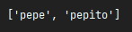

# Clase 9 Open Bootcamp
[//]: <> (This is also a comment.)
EJ. 1 Crea un script que le pida al usuario una lista de países (separados por comas). Estos se deben almacenar en una lista.
No debería haber países repetidos (haz uso de set). Finalmente, muestra por consola la lista de países
ordenados alfabéticamente y separados por comas.

EJ. 2 En este segundo ejercicio, tenéis que crear una aplicación que obtendrá los elementos impares de
una lista pasada por parámetro con filter y realizará una suma de todos estos elementos obtenidos
mediante reduce.

## Video 9 intro a la biblioteca estándar de Python y funciones built-in

Programación multi hilo, múltiples funciones en paralelo, ejemplo todas las apps que tengo funcionando al mismo tiempo
da la impresión de ser fluido, pero se dan en pequeños intervalos de tiempo NO a la vez.

Utiliza como ejemplo las librerías _thread y time, para correr en paralelo funciones. Medio difícil.

Segundo ejemplo importa logging, <https://docs.python.org/3.10/library/logging.html> este módulo tiene muchas severities
(niveles de alerta) los loggers tarzan lo que hace el programa

### Ahora cambio el nivel de alerta

   muestra a partir de warning 

Para refrescar las funciones built-in: <https://j2logo.com/python/tutorial/espacios-de-nombres-modulos-y-paquetes/>

**Función filter**, aplica una función a todos los elementos de una lista, arroja true o false, y devuelve únicamente los parámetros que cumplen con esa función.

### Otro ejemplo

 ... 

### Función map

Esta función aplica a todos los elementos de la lista la función llamada.

 ....

### Función reduce

Esta función va a ejecutar de forma recursiva una función sobre la lista, hasta que la lista se quede con un único elemento
dicho de otra manera ***ejecuta cíclicamente la función sobre el resultado anterior***.

### Función zip

Esta agrega iterables en una tuple y los devuelve, (tuple = inmutables, lista = iterables) los combina.
 .... 

Cada elemento de la lista es una tupla, solo va a asociar a los elementos que pueda emparejar, los sobrantes de 
cualquiera de las dos listas quedaran fuera.

### Palabras reservadas *all* y *any*

Sirven para verificar que todas las condiciones de una lista se cumplan *(all)* o algunas de las condiciones de una 
lista se cumplan *(any)*.

... 

### Funciones *round* y *min*

Sencillo una redondea decimales de .5 hacia arriba y .4 hacia abajo, **min** saca el mínimo de una lista.

---- 

### Función pow

Sirve para elevar, por ejemplo 2 elevado a 4

 ---- = 16

### Algunas funciones con listas

 ---- 

**Agregando una función lambda puedo forzar comportamientos**

### Función input

Simplemente con la sintaxis adecuada muestra un mensaje en pantalla y queda esperando la respuesta que es almacenada en 
una variable.

 .... 

